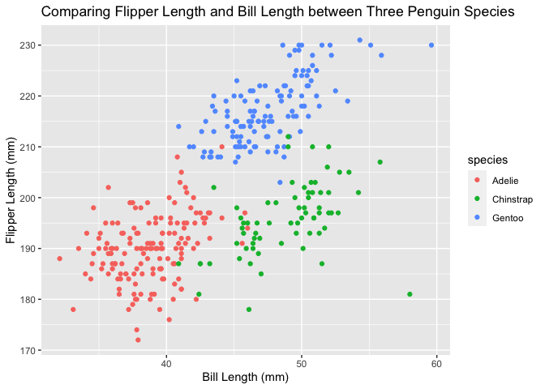

Homework 1
================
Amy Pitts
9/11/2020

## Problem 1

Creating a dataframe based on the specifications

``` r
prob1_df = 
  tibble(
    samp = rnorm(10), # a random sample of size 10 from a standard Normal distribution
    samp_gt_0 = samp > 0, # a logical vector indicating whether elements of the sample are greater than 0
    char_vec = c("a", "b", "c", "d", "e", "f", "g", "h", "i", "j"), # a character vector of length 10
    factor_vec = factor(c("low", "low", "low", "mod", "mod", "mod", "high", "high", "high", "high")) 
      # a factor vector of length 10, with 3 different factor “levels”
  )
prob1_df
```

    ## # A tibble: 10 x 4
    ##       samp samp_gt_0 char_vec factor_vec
    ##      <dbl> <lgl>     <chr>    <fct>     
    ##  1  0.0975 TRUE      a        low       
    ##  2  0.174  TRUE      b        low       
    ##  3 -0.154  FALSE     c        low       
    ##  4 -1.14   FALSE     d        mod       
    ##  5  2.06   TRUE      e        mod       
    ##  6  1.75   TRUE      f        mod       
    ##  7  0.749  TRUE      g        high      
    ##  8  0.940  TRUE      h        high      
    ##  9  0.606  TRUE      i        high      
    ## 10  1.01   TRUE      j        high

We are now taking the mean for each variable

``` r
mean(pull(prob1_df, samp))
```

    ## [1] 0.6092611

``` r
mean(pull(prob1_df, samp_gt_0))
```

    ## [1] 0.8

``` r
mean(pull(prob1_df, char_vec))
```

    ## Warning in mean.default(pull(prob1_df, char_vec)): argument is not numeric or
    ## logical: returning NA

    ## [1] NA

``` r
mean(pull(prob1_df, factor_vec))
```

    ## Warning in mean.default(pull(prob1_df, factor_vec)): argument is not numeric or
    ## logical: returning NA

    ## [1] NA

So far the random sample is the only one that I know should work. This
is becuase they are numeric values. The vec\_logic variable also
produces results which I find interesting because it is actually a true
and false value. I bet the mean is representing how often true comes up.
The last to variables do not work and that is because they are not
numeric values.

Number and logical and okay for taking the mean but not character.

``` r
as.numeric(pull(prob1_df, samp_gt_0)) #this works
```

    ##  [1] 1 1 0 0 1 1 1 1 1 1

``` r
as.numeric(pull(prob1_df, char_vec)) #this does not
```

    ## Warning: NAs introduced by coercion

    ##  [1] NA NA NA NA NA NA NA NA NA NA

``` r
as.numeric(pull(prob1_df, factor_vec)) #this one worked
```

    ##  [1] 2 2 2 3 3 3 1 1 1 1

The as numeric function works on the logic statement and the factored
variable but not the character variable. The logic statement was
assigned 0 and 1s while the factored variable was assigned 1 through 3.
If i had factored the character variable before doing the as numeric
function then the character variables would have been numbers rather
than NA.

``` r
# convert the logical vector to numeric, and multiply the random sample by the result
as.numeric(pull(prob1_df, samp_gt_0)) * pull(prob1_df, samp)
```

    ##  [1] 0.09746123 0.17412185 0.00000000 0.00000000 2.05561326 1.74810658
    ##  [7] 0.74872900 0.94015637 0.60563803 1.01249454

``` r
# convert the logical vector to a factor, and multiply the random sample by the result
factor(pull(prob1_df, samp_gt_0)) * pull(prob1_df, samp)
```

    ## Warning in Ops.factor(factor(pull(prob1_df, samp_gt_0)), pull(prob1_df, : '*'
    ## not meaningful for factors

    ##  [1] NA NA NA NA NA NA NA NA NA NA

``` r
# convert the logical vector to a factor and then convert the result to numeric, 
  # and multiply the random sample by the result
as.numeric(factor(pull(prob1_df, samp_gt_0))) * pull(prob1_df, samp)
```

    ##  [1]  0.1949225  0.3482437 -0.1541065 -1.1356029  4.1112265  3.4962132
    ##  [7]  1.4974580  1.8803127  1.2112761  2.0249891

## Problem 2

``` r
data("penguins", package = "palmerpenguins")
```

``` r
dim(penguins) #printing th dimentions
```

    ## [1] 344   8

``` r
variable.names(penguins) #the vraible names
```

    ## [1] "species"           "island"            "bill_length_mm"   
    ## [4] "bill_depth_mm"     "flipper_length_mm" "body_mass_g"      
    ## [7] "sex"               "year"

``` r
mean(pull(penguins, flipper_length_mm), na.rm=TRUE) #mean flipper length
```

    ## [1] 200.9152

This is a 8 variable dataset with 344 entries. The 8 variable names are
listed above. The mean flipper length is 200.9152

``` r
summary(penguins) #this gives us a summary of the varaibles. 
```

    ##       species          island    bill_length_mm  bill_depth_mm  
    ##  Adelie   :152   Biscoe   :168   Min.   :32.10   Min.   :13.10  
    ##  Chinstrap: 68   Dream    :124   1st Qu.:39.23   1st Qu.:15.60  
    ##  Gentoo   :124   Torgersen: 52   Median :44.45   Median :17.30  
    ##                                  Mean   :43.92   Mean   :17.15  
    ##                                  3rd Qu.:48.50   3rd Qu.:18.70  
    ##                                  Max.   :59.60   Max.   :21.50  
    ##                                  NA's   :2       NA's   :2      
    ##  flipper_length_mm  body_mass_g       sex           year     
    ##  Min.   :172.0     Min.   :2700   female:165   Min.   :2007  
    ##  1st Qu.:190.0     1st Qu.:3550   male  :168   1st Qu.:2007  
    ##  Median :197.0     Median :4050   NA's  : 11   Median :2008  
    ##  Mean   :200.9     Mean   :4202                Mean   :2008  
    ##  3rd Qu.:213.0     3rd Qu.:4750                3rd Qu.:2009  
    ##  Max.   :231.0     Max.   :6300                Max.   :2009  
    ##  NA's   :2         NA's   :2

From this quick summary I see that species and island are factored with
three options. Next the sex variable is also two options of female and
male, with 11 missing values. The rest of the variables are numerical
and there are missing values in each. Since the missing values will mess
up our analysis we will want to ignore them for now. Since there are a
low number this is okay, but if there was a bigger number of missing
numbers we would have to worry about the introduction of bias.

I am now going to summarize the data by grouping the pengiuns first by
species and then by island.

``` r
group_summary = penguins %>% 
  group_by(species, island) %>%
  summarise(n = n(),
            bill_lenth_mean = mean(bill_length_mm, na.rm = TRUE),
            bill_dept_mean  = mean(bill_depth_mm, na.rm = TRUE), 
            flipper_lenth_mean = mean(flipper_length_mm, na.rm = TRUE),
            body_mass_mean = mean(body_mass_g, na.rm = TRUE)) 
print(group_summary, width=Inf)
```

    ## # A tibble: 5 x 7
    ## # Groups:   species [3]
    ##   species   island        n bill_lenth_mean bill_dept_mean flipper_lenth_mean
    ##   <fct>     <fct>     <int>           <dbl>          <dbl>              <dbl>
    ## 1 Adelie    Biscoe       44            39.0           18.4               189.
    ## 2 Adelie    Dream        56            38.5           18.3               190.
    ## 3 Adelie    Torgersen    52            39.0           18.4               191.
    ## 4 Chinstrap Dream        68            48.8           18.4               196.
    ## 5 Gentoo    Biscoe      124            47.5           15.0               217.
    ##   body_mass_mean
    ##            <dbl>
    ## 1          3710.
    ## 2          3688.
    ## 3          3706.
    ## 4          3733.
    ## 5          5076.

First thing we notice is that Adelie penguin is on all three island
while the Chinstrap is on the Dream island and the Gentoo only on the
Biscoe island. The next thing I notice is that the bill depth is much
smaller and the body mass seems to be much bigger for the Gentoo pengiun
compared to all the species. Overall the Adelie pengiun and the
Chinstrap seem to be a little more comparable with the bill length being
a little bigger than the Adelie comparing the means of the variables.

We can now make a scatter plot of variables to see the relation.

``` r
p <- ggplot(penguins, aes( bill_length_mm, flipper_length_mm)) + 
    geom_point(aes(colour = species)) + 
    ggtitle("Comparing Flipper Length and Bill Length between Three Penguin Species") +
    xlab("Bill Length (mm)") +
    ylab("Flipper Length (mm)")
p
```

<!-- -->

``` r
#Exporing the graph and saving it in the porject directory. 
ggsave("scatter_plot_penguin.pdf", height = 4, width = 6) 
```
